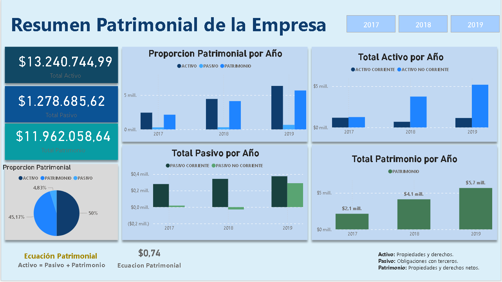
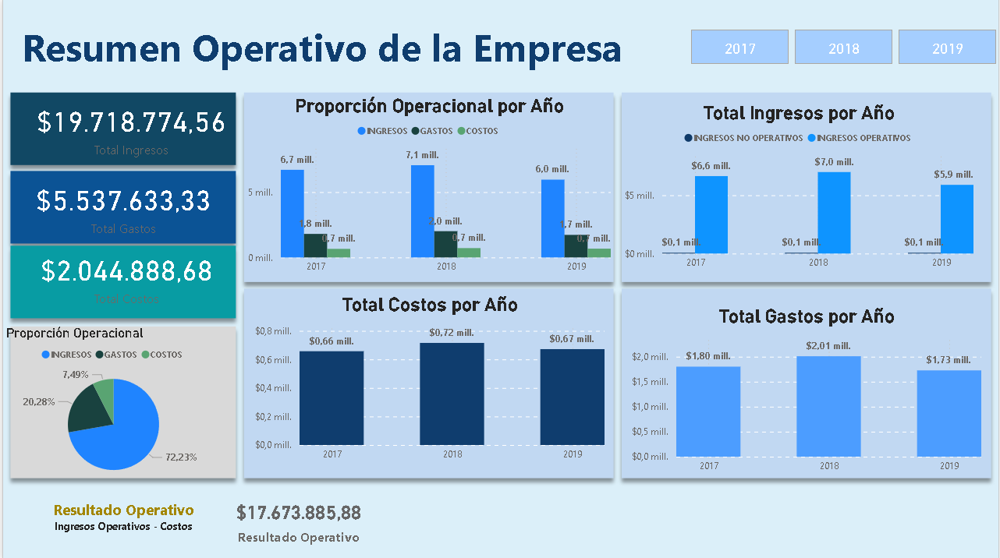
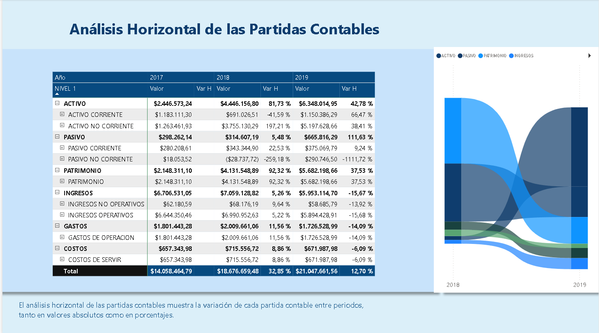
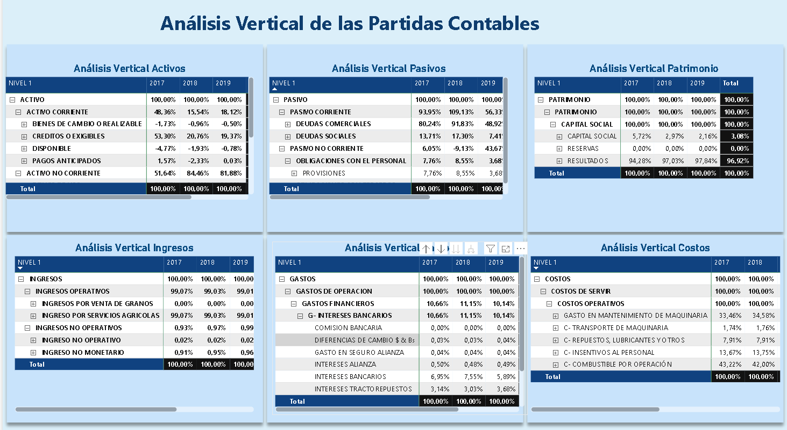
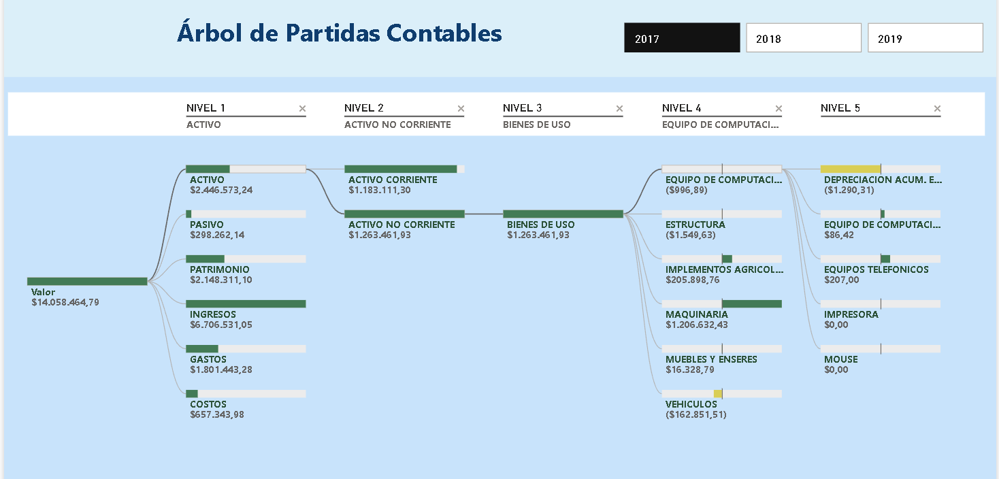
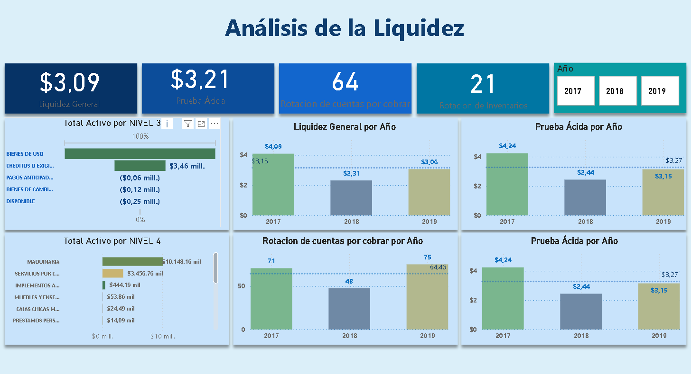
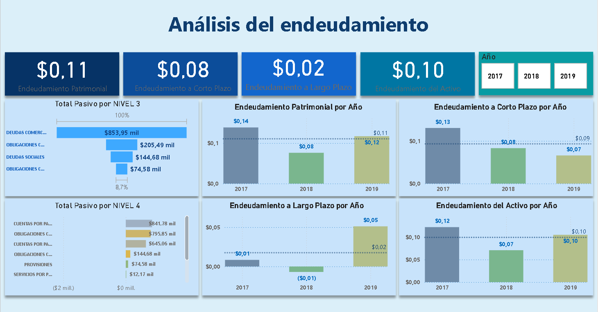
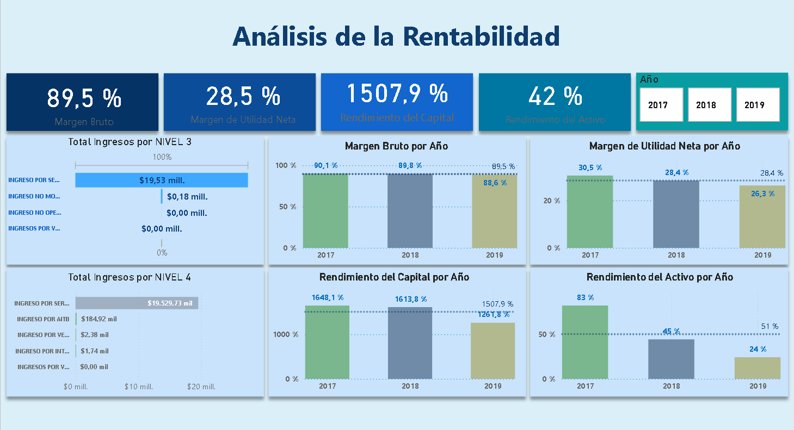

# 📊 Dashboard Financiero en Power BI

## 📌 Executive Summary

Este proyecto presenta un **Dashboard Financiero en Power BI** diseñado a partir de un plan contable estructurado (NIVEL 1–5).  
El tablero integra **análisis horizontal, vertical e indicadores financieros clave** (liquidez, endeudamiento y rentabilidad) para evaluar la salud financiera de la empresa.

### 🔑 Principales hallazgos
- **Estructura patrimonial sólida**: más del 90% de los activos financiados con patrimonio.  
- **Liquidez destacada**: Liquidez General = 3.09 y Prueba Ácida = 3.21 → excelente capacidad de pago.  
- **Endeudamiento bajo**: relación Pasivo/Patrimonio de 0.10 → autonomía financiera.  
- **Rentabilidad sobresaliente**: Margen Neto 28,5%, ROA 42% y ROE > 1000% (influenciado por bajo capital social).  
- **Riesgos identificados**: caída de ingresos en 2019 (-15,6%) y concentración de activos en cuentas por cobrar.

### 📌 Recomendaciones
1. **Ampliar el modelo** incorporando estados de flujo de efectivo para un análisis de solvencia más robusto.  
2. **Conectar a una fuente dinámica** (Excel, SQL, API) para que el dashboard se actualice automáticamente.  
3. **Enriquecer el storytelling visual** agregando narrativas automáticas en DAX e indicadores de alerta.  
4. **Escalar el modelo** aplicando un enfoque de *star schema* con `FactTransacciones` y dimensiones (`DimCuenta`, `DimCalendario`).  

---

## 🖼️ Vistas del Dashboard

### 1. Resumen Patrimonial
  
📌 **Conclusión:**  
La empresa mantiene una estructura patrimonial **muy sólida**, con activos financiados en más de un 90% por patrimonio y apenas un 10% por pasivos. Esto refleja independencia financiera, bajo riesgo de solvencia y capacidad de resistir crisis externas. Sin embargo, esta baja deuda también implica que la empresa podría estar desaprovechando la oportunidad de apalancarse con financiamiento barato para acelerar su crecimiento.

---

### 2. Resumen Operativo
  
📌 **Conclusión:**  
La empresa presenta un **resultado operativo positivo y robusto**, con costos relativamente bajos frente a ingresos. Sin embargo, se observa una caída de ingresos en 2019 (-15,6%), lo que indica que, a pesar de ser rentable, la organización debe analizar causas (ejemplo: caída de demanda, aumento de competencia, cambios en precios) para asegurar sostenibilidad futura.

---

### 3. Análisis Horizontal
  
📌 **Conclusión:**  
El crecimiento del activo no corriente en 2018 (+197%) muestra una fuerte apuesta por inversión a largo plazo (posiblemente en activos fijos o mejoras de infraestructura). Esto es positivo, pero debe contrastarse con la generación de ingresos para asegurar que la inversión se traduzca en crecimiento sostenible. La caída de ingresos en 2019 es una alerta temprana que debe monitorearse.

---

### 4. Análisis Vertical
  
📌 **Conclusión:**  
La concentración en **cuentas por cobrar** dentro del activo refleja una política de crédito agresiva o dependencia de pocos clientes. Esto puede ser riesgoso si la cobranza no es eficiente. En el pasivo, el peso de las deudas comerciales indica que las obligaciones son principalmente operativas y no financieras. El patrimonio está altamente explicado por resultados acumulados, lo cual es positivo pero también resalta la importancia de seguir generando utilidades.

---

### 5. Árbol de Partidas Contables
  
📌 **Conclusión:**  
El árbol jerárquico permite **navegar desde el patrimonio hacia el capital social y resultados**, lo que facilita transparencia y trazabilidad contable. Este drill-down es valioso para auditores o analistas, ya que permite conectar el detalle de las transacciones con los estados financieros consolidados.

---

### 6. Análisis de Liquidez
  
📌 **Conclusión:**  
Los indicadores de liquidez son excelentes (Liquidez general 3.09 y Prueba ácida 3.21). Esto significa que la empresa podría cubrir tres veces sus obligaciones de corto plazo con activos líquidos. Además, la alta rotación de cuentas por cobrar (64 veces al año) indica que la empresa cobra muy rápido a sus clientes. Esto genera una **posición de caja muy cómoda**, aunque también podría reflejar que la empresa ofrece poco crédito, limitando potencial de ventas.

---

### 7. Análisis de Endeudamiento
  
📌 **Conclusión:**  
El endeudamiento total es apenas de 0.10, con la mayor parte concentrada en pasivos de corto plazo. Esto significa que la empresa tiene **margen para asumir deuda de largo plazo** y financiar proyectos de expansión sin comprometer su estabilidad. Sin embargo, depender demasiado del patrimonio puede significar menor rendimiento financiero por falta de apalancamiento.

---

### 8. Análisis de Rentabilidad
  
📌 **Conclusión:**  
La rentabilidad es sobresaliente: margen bruto 89,5%, margen neto 28,5%, ROA 42% y ROE superior al 1000%. Esto último se explica por un capital social muy bajo en comparación con las utilidades, lo que dispara el ROE. Aunque estos indicadores son positivos, es importante analizar su sostenibilidad: un ROE tan alto podría no ser replicable en el largo plazo si no se reinvierte capital o no se controla la caída de ingresos observada en 2019.

---

## 📖 Diccionario de Datos

| Campo | Tipo | Descripción | Ejemplo |
|-------|------|-------------|---------|
| **CUENTA** | Texto | Código contable según PCGE/empresa. | 6030130001 |
| **NOMBRE DE LA CUENTA** | Texto | Nombre de la cuenta contable. | MANTENIMIENTO DE TRACTORES |
| **Fecha** | Fecha | Fecha contable de la transacción. | 01/05/2017 |
| **Monto** | Decimal | Valor monetario de la transacción. | 1250.50 |
| **CUENTA T** | Texto | Cuenta T o agrupadora. | 6030113001 |
| **NIVEL 1** | Texto | Clase principal (Activo, Pasivo, Patrimonio, Ingresos, Gastos, Costos). | GASTOS |
| **NIVEL 2** | Texto | Subclase (ej. Gastos de Operación). | GASTOS DE OPERACIÓN |
| **NIVEL 3** | Texto | Agrupación detallada. | GASTOS ADMINISTRATIVOS |
| **NIVEL 4** | Texto | Subagrupación específica. | MANTENIMIENTOS CORRECTIVOS |
| **NIVEL 5** | Texto | Detalle más específico. | MANTENIMIENTO DE FUMIGADORA |
| **Orden** | Entero | Control de orden en reportes. | 5 |

---

## 📌 Conclusiones del Proyecto  

1. Se logró construir un **dashboard financiero integral** en Power BI que combina análisis horizontal, vertical y de ratios financieros.  
2. La estructura basada en el **plan contable (NIVEL 1–5)** permitió generar jerarquías claras y navegación drill-down.  
3. El uso de **medidas DAX personalizadas** hizo posible calcular indicadores clave como liquidez, endeudamiento y rentabilidad.  
4. La documentación (README + diccionario de datos) facilita la comprensión del modelo a terceros y fortalece su valor como proyecto de portafolio.  

## 📌 Recomendaciones de Mejora  

1. **Ampliar fuentes de datos:** incorporar estados de flujo de efectivo para un análisis más completo de solvencia y liquidez.  
2. **Automatización:** conectar el modelo a una fuente de datos dinámica (ej. Excel actualizado, SQL o API) para actualizar los indicadores en tiempo real.  
3. **Visuales avanzados:** implementar gráficos adicionales (heatmaps, decomposition tree) para enriquecer el análisis.  
4. **Storytelling financiero:** incluir tarjetas con frases interpretativas automáticas en DAX (ejemplo: “El ROE aumentó en 5% respecto al año anterior”).  
5. **Internacionalización:** traducir el README al inglés y crear un tema de colores corporativo (JSON) para dar consistencia visual.  
6. **Escalabilidad:** separar la tabla de transacciones (`FactTransacciones`) y dimensiones (`DimCuenta`, `DimCalendario`) para un modelo más robusto y fácil de mantener.  

---

✍️ **Autor:** [Ruth Castañeda]  
📌 Proyecto académico/portafolio en **Power BI, Contabilidad y Análisis Financiero**.  
